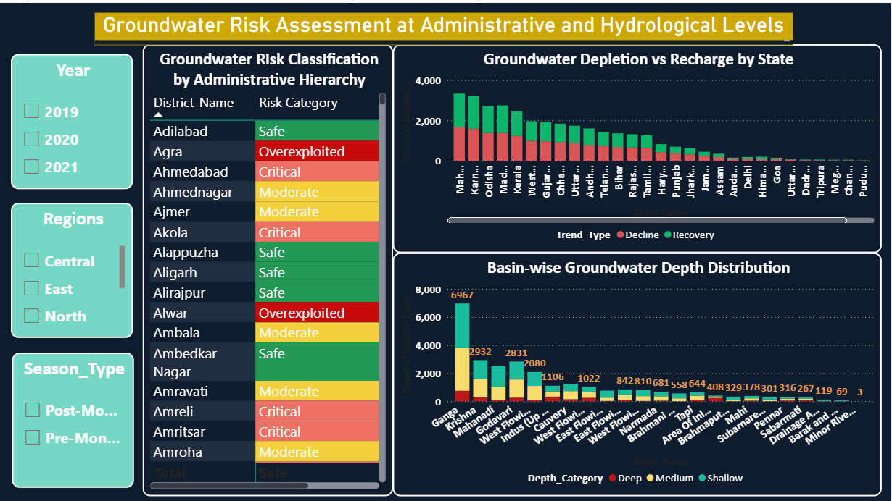

# Data-Driven Analysis of Ground Water Trends and Stress Zones in India

## 📌 Project Overview
Groundwater is a critical resource for agriculture, domestic, and industrial use in India. However, excessive extraction and changing environmental conditions have led to declining groundwater levels in several regions.

This project analyzes groundwater level data collected by the Central Ground Water Board (CGWB) to identify groundwater trends, seasonal variations, stress zones, and risk categories across India using data analytics tools.

---

## 🎯 Project Objectives
- Analyze groundwater level changes across regions,states,districts and stations of India
- Identify areas facing serious groundwater depletion
- Study seasonal (Pre & Post Monsoon) variations
- Classify regions into Safe, Moderate, Critical, and Overexploited categories
- Perform basin-wise and administrative-level analysis
- Build an interactive dashboard for multi-level exploration

---

## 📊 Dataset Information
- Source: [Central Ground Water Board (CGWB)](https://indiadataportal.com/p/groundwater/r/mojs-wris_cgwb_wells_level_changes-pl-ot-aaa)
- Observation Wells: ~22,965 monitoring stations
- Original Records: ~5,00,000+
- Filtered Dataset Used: ~1,25,000 (2019–2021)
- GitHub Sample Uploaded: ~50,000 rows
- Domain: Environmental Science with Data Analytics

The analysis was restricted to 2019–2021 to ensure consistency and reliable state-wise coverage.

---

## 🛠 Tools & Technologies
- **Microsoft Excel (64-bit)**  
  - Data cleaning and preprocessing  
  - TRIM, CLEAN, PROPER functions  
  - INDEX & MATCH mapping  
  - Advanced Filter  
  - Statistical Analysis ToolPak  
  - Fact-Dimension schema preparation  

- **Power BI**
  - Hybrid Snowflake Data Model
  - DAX measures and calculated columns
  - Interactive dashboard creation
  - Hierarchical drill-down analysis

---

## 🧹 Data Preprocessing Highlights
- Standardized state and district names
- Corrected spelling inconsistencies
- Removed duplicate station entries
- Created Depth_Category (Shallow / Medium / Deep)
- Created Trend_Type (Decline / Recovery / Stable)
- Designed Hybrid Snowflake Schema:
  - 1 Fact Table
  - Multiple Dimension Tables (Region, State, District, Station, Basin, Date)
  - Administrative & Hydrological Hierarchies

---

## 📐 Data Modeling
A **Hybrid Snowflake Schema** was implemented:

- Fact_Ground_Water connected to:
  - Dim_Station
  - Dim_Date
- Administrative Hierarchy:
  Country → Region → State → District → Station
- Hydrological Hierarchy:
  Basin → Station

All relationships were defined as one-to-many (1:*).

---

## 📊 Key DAX Measures
- Total Monitored Stations
- Total Deep Stations
- % Deep Stations
- Data Coverage %
- Average Current Depth
- Risk Category Classification

---

## 📈 Dashboard Features
- KPI Cards (Coverage %, % Deep, Risk Category, Avg Depth)
- 100% Stacked Bar Charts (Depth distribution)
- Line Chart (Year-wise depth trend)
- Donut Chart (Region-wise deep %)
- Matrix (Risk classification with drill-down)
- Map Visual (Spatial groundwater distribution)
- Basin-wise and State-wise Decline vs Recovery analysis

Interactive features:
- Drill-down (Country → Region → State → District)
- Year & Season slicers
- Cross-filtering visuals

---

## 🔎 Key Findings
- North and Western states (Rajasthan, Haryana, Punjab, Delhi, Gujarat) show higher groundwater stress.
- North-Eastern and Eastern states show relatively healthier groundwater conditions.
- ~17% of monitored stations fall under the Deep category.
- Post-monsoon recharge exists but its effectiveness shows signs of reduction.
- Significant spatial clustering of high-stress zones observed.
- Statistical analysis confirms high variability and extreme depletion cases.

---

## 🌍 Groundwater Risk Insights
- Groundwater stress is spatially uneven across India.
- Certain districts fall under Critical and Overexploited categories.
- Basin-level imbalances indicate hydrological stress.
- Continued extraction without recharge may worsen future water scarcity.

---

## 📷 Dashboard Preview
(Added screenshots inside Images folder)

.png)



.png)

---

## 📂 Repository Structure
```
Data/
   raw_data/
   processed_data/

Documentation/
Images/
Power BI/
```

---

## 🏁 Final Conclusion
This project demonstrates how data analytics tools like Excel and Power BI can be applied to environmental datasets to identify groundwater stress patterns, evaluate risk levels, and support sustainable water resource management decisions.

---

## 👩‍💻 Author
Divya Thatha
